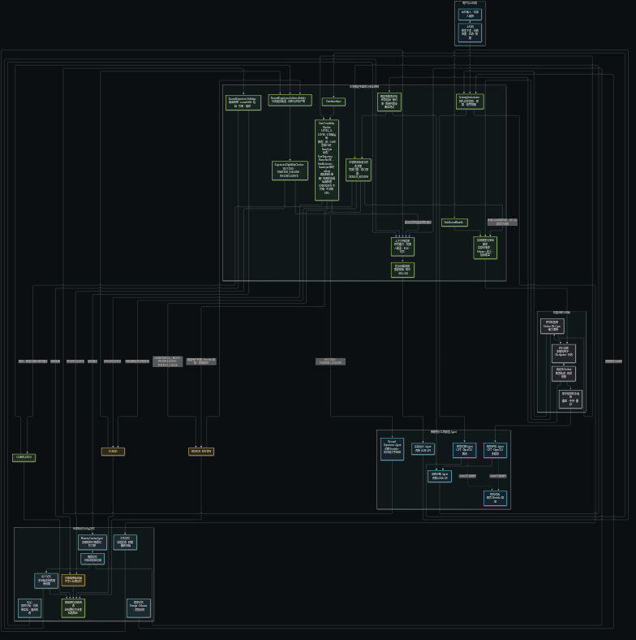

# 强化学习训练 Agent 完整技术文档

本文是当前 `rl_agent` 的总设计说明，覆盖目标、架构、角色、数据协议、状态机、RAG、四层记忆、奖励生成、PPO 训练、联合评估、自动修订、上位机、产物、安全边界、运行方式和后续路线图。

更新日期：2026-09-22。

## 1. 系统定位

该项目是一个自然语言驱动的四足机器人强化学习训练 Agent。用户只需要描述目标动作并选择机器人，系统负责把自然语言转换为结构化任务和奖励方案，安全编译训练配置，执行多随机种子 PPO 训练，收集数值与视觉证据，判断是否达到目标，并在未通过时自动诊断、修订和重训。

系统不是单个大模型提示词，而是“本地确定性协调器 + 多个专职模型 Agent + 仿真工具链 + RAG + 四层记忆”的有状态闭环。

系统当前只负责仿真训练，不连接实体机器人，不执行自动实机部署。

## 2. 设计目标与非目标

### 2.1 设计目标

- 接受中文自然语言动作描述，而不是要求用户手写奖励函数。
- 支持 `go2`、`h1`、`h1_2` 和 `g1` 等已注册机器人。
- 从真实 Unitree RL Gym 环境扫描可用观测、奖励、命令和评估指标。
- 让模型只能返回结构化计划，不能直接执行命令或修改训练工程。
- 使用多个奖励候选、冒烟训练和筛选降低单次生成失败风险。
- 使用多个随机种子进行完整训练和评估。
- 同时使用确定性数值指标和独立视觉评价判断动作质量。
- 失败后自动诊断并执行受限的奖励、课程或 checkpoint 策略修改。
- 保存所有任务、奖励版本、指标、视频、诊断、谱系和最终产物。
- 只把验证过的成功经验和明确失败模式写入长期记忆。
- 提供桌面上位机、命令行、实时日志、停止和恢复能力。
- 所有项目配置使用相对路径，便于移动和上传。

### 2.2 非目标

- 不替代 Isaac Gym、Unitree RL Gym 或 PPO 实现。
- 不允许模型生成并直接执行任意 Python 或 Shell。
- 不以单次奖励上升或训练进程正常退出作为“动作训练完成”。
- 不把 `dry-run`、Provider 超时或人工审核结果当作正确经验。
- 不自动向实体机器人部署策略。
- 不承诺任意自然语言动作都能由当前传感器和奖励变量实现。

## 3. 总体架构



可编辑的精确源图位于 [`images/rl-agent-architecture-v2.mmd`](images/rl-agent-architecture-v2.mmd)，图像生成提示词位于 [`images/rl-agent-architecture-v2.prompt.md`](images/rl-agent-architecture-v2.prompt.md)。

架构分为三层：

1. 用户与上位机：接收动作、机器人和运行模式，展示状态、进度、日志、历史实验和人工审核原因。
2. 本地确定性协调层：控制状态、预算、上下文、Schema、奖励审查、命令构造、评估、记忆门控和恢复。
3. 外部能力层：GPT/OpenCLI、百炼 GLM、Unitree RL Gym、Isaac Gym、RAG 与四层记忆。

最重要的控制原则是：模型可以提出方案和诊断，但不能决定安全边界，也不能绕过本地确定性验收。

## 4. Agent 角色与职责

| 角色 | 默认实现 | 输入 | 输出 | 权限边界 |
| --- | --- | --- | --- | --- |
| 协调器 | `TrainingOrchestrator` | 用户请求、状态、预算和证据 | 状态转换、实验、恢复点 | 唯一流程控制者 |
| 任务理解 Agent | GPT / OpenCLI | 动作原文、机器人 | `TaskIntentSpec` | 不生成训练命令 |
| Task Feasibility Pipeline | 本地规则 + 语义阶段 Provider + Pinocchio + Unitree Isaac Gym | TaskIntent、精简环境清单、Go2 PPO 机器人配置 | `CompleteFeasibilityReport` | 复用 PPO 环境做短时 sanity check；动态动作覆盖不足或 Mock 均不放行 |
| 上下文构建器 | 本地代码 | 能力清单、RAG、记忆 | 限长上下文快照 | 会删除源码绝对路径 |
| 提示词编译器 | 本地固定模板 | TaskIntent、上下文 | 版本化提示词和 SHA-256 | 模型不能修改模板版本 |
| 奖励设计 Agent | 百炼 GLM | 编译提示词 | `TaskRewardBundle` | 只能使用结构化 JSON |
| 奖励审查 Agent | 本地代码 | 任务、逐个候选、注册表 | 逐候选 `RewardReviewReport` | 隔离失败候选，合格候选继续；不直接修正 |
| 奖励编译器 | 本地代码 | 已审核 `RewardPlan` | 独立训练配置和 diff | 只允许注册奖励 |
| PPO 训练器 | Unitree RL Gym | 配置、种子、预算 | checkpoint、日志、指标 | 受限命令参数数组 |
| 数值评估器 | 本地代码 | 多 rollout 轨迹和指标 | `EvaluationResult` 数值门 | 最终安全裁决的一部分 |
| 视觉评估 Agent | GPT / OpenCLI | TaskSpec、同步视觉材料 | `VisualBehaviorReport` | 不读取奖励设计 RAG |
| 诊断与修订 Agent | 百炼 GLM | 数值、视觉、PPO、预算、历史 | `TrainingDiagnosis` | 修改必须再次本地校验 |
| Reward Experience Agent | `diagnosis_provider`（默认百炼 GLM）+ 本地代码 | 资格门控通过的精简证据包 | `RewardExperienceNarrative` | 只归纳文字，不改 reward/metric |
| Memory Validator | 本地代码 | Reward Experience、原始文件和 SHA-256 | 通过/拒绝 | 复核奖励差异、指标、任务和 evidence ID |
| 记忆整理 Agent | 本地代码 | 通过 Validator 的经验和多种子结果 | 情景记忆或拒绝原因 | dry-run/INCONCLUSIVE 不得晋升 |
| 语义整理 Agent | 本地代码 | 多条情景记忆 | 候选或活跃规律 | 需要独立证据阈值 |
| 程序记忆 Agent | 本地代码 | Prompt、Schema、规则 | 程序快照 | 不保存自由对话 |

生产模式的默认角色路由为：

```text
任务理解      -> GPT / OpenCLI
奖励设计      -> 百炼 GLM
视觉评估      -> GPT / OpenCLI
训练诊断      -> 百炼 GLM
奖励经验归纳  -> `diagnosis_provider`（默认百炼 GLM）
安全与完成判定 -> 本地确定性代码
```

## 5. 一次训练任务的完整闭环

### 5.1 接收与环境检查

1. 上位机或 CLI 提交动作文本、机器人和模式。
2. 协调器根据“机器人 + 原始动作”生成稳定 `task_id`。
3. 初始化实验目录和持久化状态机。
4. `EnvironmentInspector` 扫描当前训练工程，生成能力清单。
5. 能力清单包含观测量、奖励变量、注册奖励、终止条件、命令空间和可计算评估指标。

### 5.2 任务理解与上下文

1. 任务理解 Agent 将原文转换为 `TaskIntentSpec`。
2. 本地协调器重新写回用户原始指令和机器人，防止模型改写任务身份。
3. `FeasibilityPipeline` 用本地机器人/环境资产检查能力，并生成不含关节角的高层动作原型。
4. 真实 Pinocchio 根据脚端笛卡尔目标求 IK；`IsaacGymFeasibilityValidator` 加载 Unitree task_registry 的真实 Go2 PPO 环境，以其 URDF、控制器、action scale、decimation 和 PhysX 配置做短时 rollout。只创建环境，不创建 PPO runner、不训练策略。
5. 报告同时记录 `LEVEL_0_LANGUAGE` 至 `LEVEL_6_OPTIONAL_RL_PROBE` 证据层级和逐阶段 backend/指标/来源。只有覆盖目标动作的真实物理验证通过才可能继续；能力不足、Mock、`CONDITIONAL`、`INCONCLUSIVE`、模型缺失或真实物理探针失败均进入 `HUMAN_REVIEW`。只有能力清单明确确认 `UNSUPPORTED` 才进入 `FAILED`。报告保存为 `feasibility_report.json`，状态事件写入 `events.jsonl`。
6. RAG 检索项目文档和白名单历史实验，长期记忆检索活跃情景记忆和语义规律。
7. `ContextBuilder` 合并环境、机器人、RAG 和记忆，生成紧凑上下文。
8. 上下文声明历史内容只是只读证据，不能覆盖当前安全规则和 Schema。

### 5.3 奖励设计与训练前审查

1. `RewardPromptCompiler` 使用固定模板生成提示词、版本和 SHA-256。
2. 奖励设计 Agent 返回 `TaskRewardBundle`。
3. Pydantic 校验字段类型、枚举、范围和必填项。
4. `RewardReviewAgent` 检查未知奖励、指标遗漏、姿态冲突和奖励投机风险。
5. 环境检查器确认任务所需物理量可直接获得或可推导。
6. `RewardCompiler` 只把注册奖励编译到候选配置，保存配置 diff 和哈希。
7. 任一步无法安全确认时进入 `HUMAN_REVIEW`，不启动训练。

### 5.4 候选筛选与多种子训练

1. 对每个候选执行短时冒烟训练。
2. 收集有限值、硬约束、成功率、任务分数、PPO 稳定性、能耗和投机指标。
3. 只有通过硬门槛的候选才能进入综合排序。
4. 选中候选后，按照 `evaluation_seeds` 执行多随机种子完整训练。
5. 每个种子产生独立 checkpoint；父 checkpoint 和奖励谱系始终保留。

### 5.5 联合评估

1. 每个种子运行多个评估 rollout。
2. 保存前视、侧视、全景视频、轨迹、奖励分项、事件和元数据。
3. 数值评估对多 rollout 进行保守聚合。
4. 代表性 rollout 生成干净接触图、标注接触图和行为证据。
5. 视觉评估 Agent 独立判断动作阶段、失败模式、非预期行为和不确定项。
6. `DeterministicEvaluator` 联合硬约束、任务指标和视觉对齐。

完成条件为：

```text
COMPLETED = 硬安全约束通过
            AND 任务指标通过
            AND 视觉对齐通过
            AND 数值与视觉不存在冲突
```

PPO 进程正常退出、reward 上升或生成 checkpoint 都不等于完成。

### 5.6 诊断、修订和重训

未通过联合验收时，诊断 Agent 接收：

- 当前任务和奖励版本；
- 注册奖励与可计算指标；
- 多 rollout 聚合数值；
- 视觉报告；
- PPO 和逐项奖励统计；
- RAG 与长期记忆；
- 历史轮次和剩余预算。

诊断只能选择以下受限动作：

- `continue`：保持奖励版本并继续训练；
- `revise_reward`：添加、删除或更新注册奖励项；
- `revise_curriculum`：调整课程阶段；
- `restart`：保留新奖励，但从随机初始化重新训练；
- `rollback`：回到父 checkpoint；
- `complete`：必须同时得到确定性评估确认；
- `human_review`：存在真实歧义或需要用户决定；
- `failed`：存在明确且不可恢复的失败。

所有修改都会创建新候选目录、奖励版本、配置哈希和谱系边，然后重新训练和评估，直到完成、明确失败、需要人工审核或预算耗尽。

## 6. 核心结构化协议

| Schema | 作用 | 关键字段 |
| --- | --- | --- |
| `TaskIntentSpec` | 任务理解结果 | 原始指令、动作标准名、目标速度、必需/禁止行为、歧义、关键词 |
| `TaskSpec` | 可执行任务规范 | 阶段、观测、传感器、成功指标、安全约束、训练预算 |
| `RewardPlan` | 一个奖励候选 | 版本、父版本、奖励项、终止项、课程、冲突、预期阶段 |
| `TaskRewardBundle` | 奖励设计总输出 | TaskSpec、多个 RewardPlan、投机风险、终止建议 |
| `RewardReviewReport` | 训练前审查 | 是否批准、遗漏、冲突、风险和候选数量 |
| `VisualBehaviorReport` | 视觉评价 | 成功、对齐分数、阶段、失败、证据帧、不确定项 |
| `EvaluationResult` | 联合确定性结果 | 三类门控、完成判定、指标、违规和冲突 |
| `TrainingDiagnosis` | 闭环诊断 | 决策、证据、奖励修改、课程修改、风险、checkpoint 策略 |
| `ExperimentManifest` | 实验身份 | Git、配置哈希、奖励版本、种子、命令、checkpoint、结果 |
| `LongTermMemoryRecord` | 情景记忆 | 环境、奖励差异、checkpoint、数值、视觉、证据、可信度 |

Schema 位于 `rl_training_agent/schemas/`。模型回复必须先通过 Schema，才能进入下一个阶段。

## 7. 状态机

### 7.1 设计阶段

```text
RECEIVED
ENVIRONMENT_INSPECTED
TASK_UNDERSTANDING
TASK_FEASIBILITY_CHECK
RAG_RETRIEVING
CONTEXT_BUILDING
PROMPT_COMPILING
REWARD_DESIGNING
TASK_DESIGNED
REWARD_REVIEWING
REWARD_CANDIDATES_CREATED
CONFIGS_COMPILED
VALIDATED
```

可行性状态依动作类别经过 `MOTION_PROTOTYPE_GENERATING`，再进入 `STATIC_MOTION_VALIDATION` 或 `DYNAMIC_MOTION_VALIDATION`。只有覆盖用户目标的真实物理验证才能进入 `RAG_RETRIEVING`/`CONTEXT_BUILDING`；能力证据不足、Mock、动作类型未覆盖、`PHYSICS_FAILED` 或需要澄清进入 `HUMAN_REVIEW`；只有确定性能力检查明确 `UNSUPPORTED` 进入 `FAILED`。dry-run 可用 Mock 演练，但不会调用真实奖励设计/PPO。当前动态后端仅对 Go2 线速度任务运行开环关节探针；`FootTrajectory` 尚未逐帧经 IK 接入仿真，因此探针即使通过仍是 `CONDITIONAL`，不能自动放行训练。跳跃/特技只生成阶段骨架，单腿/倒立候选搜索尚未执行；转向和操控不能借用 trot validator。动态任务在奖励配置编译后另行写入 `training_readiness.json`；需要真实动态验证、编译奖励配置和确定性评估指标同时存在。可行性阶段状态操作使用 run-scoped `operation_id`，并写入 JSONL。详细限制见 [`TASK_FEASIBILITY.md`](TASK_FEASIBILITY.md)。

### 7.2 训练与评估阶段

```text
SMOKE_TRAINING
CANDIDATE_SCREENING
FULL_TRAINING
ROLLOUT_COLLECTING
VISUAL_EVALUATING
NUMERIC_EVALUATING
DIAGNOSING
```

### 7.3 闭环动作

```text
CONTINUE_TRAINING
REVISE_REWARD
REVISE_CURRICULUM
ROLLBACK
RESTART
MEMORY_CURATING
```

### 7.4 终态

- `COMPLETED`：联合验收通过。
- `HUMAN_REVIEW`：Provider 故障、不可计算需求、证据冲突、预算耗尽或需要用户决定。
- `FAILED`：确定性流程或任务被明确判定为不可恢复失败。

状态历史原子写入 `state.json`。当前轮次、奖励版本、诊断决策和预算写入 `loop_status.json`；历次联合评估写入 `loop_history.json`。

## 8. RAG 模块

RAG 是项目资料和原始历史实验的检索层，不等同于长期记忆。

### 8.1 默认来源

- 奖励设计、视觉评估和安全文档；
- 历史任务请求、TaskSpec、摘要和闭环历史；
- 奖励计划、修订审计和训练诊断。

视频、图片、checkpoint、Parquet、TensorBoard 和原始 Provider 对话不会进入索引。

### 8.2 当前实现

- 中文单字与二元词、英文变量混合分词；
- 本地 BM25 排序；
- 机器人、来源类型和实验状态有限加权；
- 当前任务排除；
- top-k 和总字符数限制；
- 来源、分数、片段和元数据审计；
- 索引损坏时失败开放，不阻塞训练主链路。

视觉评估不读取 RAG，避免历史奖励设计影响视觉裁判。

## 9. 四层记忆

| 层级 | 保存内容 | 保存位置 | 晋升规则 |
| --- | --- | --- | --- |
| 工作记忆 | 当前状态、轮次、奖励版本、预算、最新评估和诊断 | 任务目录 | 随当前任务持续更新 |
| 情景记忆 | 某机器人某动作的一次验证实验与 `RewardExperience` | `artifacts/memory/records/` | 真实 PPO、确定性资格门控、Validator 和多种子一致 |
| 语义记忆 | 跨任务通用规律 | `artifacts/memory/semantic/` | 独立任务证据达到阈值 |
| 程序记忆 | Prompt、Schema、校验和诊断策略 | `artifacts/memory/procedural/` | 每个程序版本确定性快照 |

下列结果不得晋升：

- `dry-run`；
- `HUMAN_REVIEW`；
- Provider 超时、登录问题或格式错误；
- 单随机种子；
- 缺少最终任务、奖励、闭环或评估文件；
- 没有确定性证据的普通失败。

训练终态判定之后，先由 `RewardExperienceEvidenceBuilder` 从任务、父子奖励配置、训练 manifest、checkpoint 路径、数值文件和视觉报告生成带哈希的精简证据包。`ExperienceEligibilityChecker` 将结局分类为 `SUCCESS`、`VERIFIED_FAILURE` 或 `INCONCLUSIVE`；只有前两者才调用 `Reward Experience Agent`。模型仅返回观察事实、假设、同期行为变化、局部模式和限制，奖励差异与指标始终由本地文件确定。`RewardExperienceValidator` 复核文件哈希、逐项 reward diff、评估内容、任务身份、证据引用和明显因果/泛化措辞；通过后才交给既有 `MemoryCuratorAgent`。详见 [`REWARD_EXPERIENCE.md`](REWARD_EXPERIENCE.md)。

遗忘不会删除证据。低可信、过期或超容量记录被标记为 `archived`，保存归档原因，不再参与检索。

## 10. 奖励生成与安全编译

每个奖励项必须给出名称、实现、用途、权重、参数、激活阶段、依赖、预期范围、训练趋势和投机风险。

本地编译器执行以下约束：

- 奖励名称必须存在于环境注册表；
- 权重必须有限且不超过本地上限；
- 惩罚和奖励符号必须符合注册表；
- 必选成功指标必须覆盖；
- 后腿和前腿支撑动作必须包含对应姿态门控；
- 互相冲突的姿态奖励不得同时启用；
- 生成源码必须通过 AST 限制和张量检查；
- 每次修改产生独立配置、diff、哈希和版本。

模型不能直接编辑 `unitree_rl_gym` 的原始配置。

## 11. 训练、进程和 checkpoint

`UnitreeProjectAdapter` 是训练与播放命令的唯一构造器。所有子进程使用参数数组和 `shell=False`，并保存：

- 完整参数数组；
- stdout、stderr；
- PID 和进程组；
- 启动与结束时间；
- 退出码；
- TensorBoard；
- checkpoint 列表和训练进度。

停止训练时按进程组发送终止信号，避免遗留 Isaac Gym 子进程。恢复训练时重新读取任务、奖励、checkpoint、历史轮次和剩余预算。

## 12. 视觉和数值证据

真实 rollout 默认生成：

- `front.mp4`、`side.mp4`、`overview.mp4`；
- `trajectory.parquet`、`rewards.parquet`；
- `metadata.json`、`events.json`；
- 干净接触图、标注接触图和多视角图；
- 行为证据和视觉附件清单；
- 数值汇总、视觉报告、联合评估和诊断。

数值证据用于速度、姿态、接触、能耗、关节、力矩和异常终止等可计算指标。视觉证据用于动作语义、阶段连续性、非预期行为和难以完全由数值表达的质量判断。

视觉与数值不一致时不能完成任务，必须继续诊断或进入人工审核。

## 13. 上位机

桌面入口默认使用隔离 Chrome 应用窗口，Tk 界面作为后备。主要能力包括：

- 动作输入；
- 机器人选择；
- 离线演练和真实训练；
- 当前状态、总体进度和阶段名称；
- PPO iteration 和训练进程；
- 闭环轮次、奖励版本、诊断决策和剩余预算；
- 增量日志；
- 最近实验；
- 安全停止；
- 人工审核原因；
- 从已有 checkpoint 恢复闭环；
- RAG、情景记忆、语义记忆和 Provider 状态。

本地 API：

| 方法 | 路径 | 作用 |
| --- | --- | --- |
| GET | `/api/config` | 机器人、模式和系统健康信息 |
| GET | `/api/jobs` | 作业和最近实验 |
| POST | `/api/jobs` | 创建训练作业 |
| GET | `/api/jobs/<id>` | 获取单个作业状态 |
| GET | `/api/jobs/<id>/logs` | 按字节偏移读取增量日志 |
| POST | `/api/jobs/<id>/stop` | 停止作业 |
| POST | `/api/jobs/<id>/resume` | 恢复人工审核任务 |

服务默认只监听 `127.0.0.1`，不是面向公网的多用户训练平台。

## 14. 实验与公共产物

每个任务的主要结构如下：

```text
experiments/<task-id>/
├── task_request.txt
├── task_intent.json
├── task_spec.json
├── environment_manifest.json
├── context_snapshot.json
├── reward_review.json
├── state.json
├── loop_status.json
├── loop_history.json
├── lineage.json
├── memory/working_memory.json
├── memory/promotion.json
├── candidates/<experiment-id>/
│   ├── manifest.json
│   ├── reward_plan.json
│   ├── config.yaml
│   ├── config.diff
│   ├── revision_audit.json
│   ├── checkpoints/
│   ├── metrics/
│   └── rollouts/
├── final/
│   ├── checkpoint.pt
│   ├── config.yaml
│   ├── reward_plan.json
│   └── contact_sheet_*.png
├── summary.json
└── report.md
```

公共产物包括：

```text
artifacts/
├── environment_manifest.json
├── rag/index.json
├── memory/records/
├── memory/semantic/
├── memory/procedural/
├── opencli_test/
└── ui_jobs/
```

所有持久化路径和命令参数保持相对可移植形式；运行时绝对路径不写入模型上下文。

## 15. 配置

### 15.1 `config/agent.yaml`

控制训练工程、实验目录、角色路由、候选数、训练阶段预算、随机种子、rollout、RAG 和记忆阈值。

### 15.2 `config/opencli.yaml`

控制浏览器会话、bind/owned 模式、命令超时、提交确认、回复等待、附件阈值和重试。

### 15.3 `config/bailian.yaml`

控制百炼模型、OpenAI 兼容端点、超时、重试、思考模式和 JSON 输出。API Key 只能通过 `DASHSCOPE_API_KEY` 提供。

## 16. CLI

```bash
# 环境与 Provider 健康检查
python -m rl_training_agent doctor

# 扫描机器人能力
python -m rl_training_agent inspect-env --robot go2

# 只生成并校验计划
python -m rl_training_agent plan --task "稳定向前行走" --robot go2

# 离线闭环演练
python -m rl_training_agent train \
  --task "稳定向前行走" --robot go2 --provider mock --dry-run

# 真实训练
python -m rl_training_agent train \
  --task "稳定向前行走" --robot go2 --provider multi-agent

# 恢复闭环
python -m rl_training_agent resume --task-id task-xxxxxxxxxx

# 查看状态和报告
python -m rl_training_agent status --task-id task-xxxxxxxxxx
python -m rl_training_agent report --task-id task-xxxxxxxxxx

# 播放最终策略
python -m rl_training_agent play \
  --task-id task-xxxxxxxxxx \
  --checkpoint experiments/task-xxxxxxxxxx/final/checkpoint.pt

# RAG 和记忆
python -m rl_training_agent rag-index
python -m rl_training_agent rag-query --query "后腿站立奖励" --robot go2
python -m rl_training_agent memory-stats
python -m rl_training_agent memory-query --query "后腿站立行走" --robot go2
```

## 17. 故障与恢复原则

| 问题 | 状态或行为 | 恢复方式 |
| --- | --- | --- |
| OpenCLI/百炼超时 | `HUMAN_REVIEW` 或命令错误 | 修复 Provider，复用任务恢复 |
| ChatGPT 未登录/验证码 | 不当作成功回复 | 人工登录后运行 `opencli-test` |
| 奖励引用未知项 | 审查失败 | 修改模型输出或注册环境能力 |
| 任务指标不可计算 | `HUMAN_REVIEW` | 增加指标采集或调整目标 |
| 候选全部不安全 | 阻止完整训练 | 审查奖励和硬约束 |
| 训练进程退出 | 保存退出码和日志 | 修复环境后从候选恢复 |
| 视觉与数值冲突 | 不进入 `COMPLETED` | 增加证据或人工审核 |
| 自动修订预算耗尽 | `HUMAN_REVIEW` | 用户决定增加预算或修改目标 |
| RAG 索引损坏 | 记录错误并继续 | 执行 `rag-index` 重建 |
| 记忆记录损坏 | 跳过单条记录 | 根据实验证据重新整理 |

## 18. 安全边界

- 仅仿真，不连接实机。
- 模型无 Shell 和文件写权限。
- 训练命令由白名单参数构造。
- 输入体积、机器人、模式和路径均在服务端验证。
- checkpoint 必须位于对应任务目录。
- 不覆盖原始训练配置和父 checkpoint。
- 硬安全约束不能被模型决定覆盖。
- API Key 不写入配置、日志或 Provider 审计。
- `HUMAN_REVIEW`、Provider 故障和模拟结果不得成为正确长期经验。
- Sim-to-Real 必须作为独立项目完成域随机化、系统辨识、硬件限幅、急停和人工批准。

## 19. 当前验证状态

- 109 项自动测试通过。
- Python 编译、前端 JavaScript 语法和补丁空白检查通过。
- 生产代码函数具有中文 docstring。
- 完整多 Agent dry-run 闭环通过。
- dry-run 能生成工作与程序记忆，但会被情景记忆门控拒绝。
- Isaac Gym、CUDA 和真实 PPO 启动曾完成验证。
- OpenCLI 文本、图片上传和视觉结构化回复曾完成真实验证。
- 当前仍需在实际工作站重新确认 OpenCLI Browser Bridge 和百炼密钥状态。
- 尚未完成覆盖多动作、多机器人、多随机种子的真实长时收敛基准。

## 20. 还需要完善的内容

以下不是当前主链路的占位功能，而是从“可运行研究原型”升级到“稳定训练平台”需要完成的工程工作。

### P0：真实闭环验收（代码已实现，真实长训练结果待外部执行）

#### 20.1 建立真实动作基准集（已实现协议和运行器）

至少选择前进、转弯、跳跃、后腿站立和后腿行走五类任务，每类固定机器人、环境 commit、三个以上随机种子、预算和验收阈值。保存基线成功率、失败率、训练时间和 GPU 资源。

完成标准：相同 commit 和配置下重复运行结果落在预设置信区间内，且最终报告能解释每次失败。

#### 20.2 视觉评估覆盖多种子和最差样本（已实现）

当前数值评估聚合全部 rollout，但视觉评估主要使用中位代表性 rollout。应同时提交“最差、中央、最好”三个代表，或者分别评价每个种子，再使用保守规则聚合。

完成标准：单个种子发生摔倒、拖地或奖励投机时，不能被中央样本掩盖。

#### 20.3 严格状态转换表和幂等恢复（已实现）

状态由允许转换矩阵约束并持久化；关键阶段使用幂等操作键，恢复时校验任务、候选、配置哈希和 checkpoint。恢复安全性仍应通过真实进程中断场景持续回归验证。

完成标准：重复调用、崩溃恢复和并发请求不会重复提交模型消息、重复扣减预算或误用旧 checkpoint。

#### 20.4 Provider 角色注册表（已实现）

配置已经声明各角色 Provider，但 `MultiAgentProvider` 仍以固定 OpenCLI/百炼组合为主。应增加 Provider 工厂和角色能力声明，启动时验证文本、图片和结构化 JSON 能力。

完成标准：修改配置即可替换单个角色，能力不匹配时在训练前失败，而不是运行中失败。

### P1：知识、记忆与评估质量（已实现第一阶段）

#### 20.5 混合检索与重排（BM25 + 本地 TF-IDF + 确定性重排已实现）

BM25 对准确变量名和中文短语有效，但对同义表达能力有限。可增加本地嵌入召回、BM25/向量融合和轻量重排，同时保留来源、信任等级和字符预算。

完成标准：建立固定检索评测集，比较 Recall@K、无关片段率和提示词长度，而不是只凭主观效果选择方案。

#### 20.6 语义记忆冲突治理（反例与 superseded 已实现）

当前语义升级使用保守确定性规则。后续应支持反例、适用范围、机器人/环境版本约束、规律冲突、`superseded` 和重新验证。

完成标准：新证据与旧规律冲突时不会简单叠加，能生成可审计的降级或替代关系。

#### 20.7 不确定性校准（跨 rollout 一致性校准已实现）

视觉 `confidence` 目前来自模型。应使用重复评价、一致性统计、模型版本和已标注数据校准阈值。

完成标准：在固定人工标注集上报告误报、漏报和校准误差。

#### 20.8 奖励投机专项探测（零命令反事实探针已实现）

为每类动作建立反事实测试，例如目标命令置零、改变方向、扰动地形和移除某一奖励项，验证策略确实学习目标动作，而不是利用固定初态或采样盲区。

完成标准：最终验收同时包含正常场景和反事实场景。

### P2：平台工程化（本地工作站版本已实现）

#### 20.9 结构化可观测性（状态、Provider 和 GPU JSONL 已实现）

在文本日志之外增加 JSONL 事件、阶段耗时、GPU 利用率、Provider 延迟、token/请求成本、训练吞吐和失败分类，并在上位机展示趋势。

#### 20.10 作业队列和资源调度（多 GPU 持久等待队列已实现）

当前上位机适合单工作站单活动任务。多用户或多 GPU 场景需要持久队列、GPU 锁、优先级、配额、取消语义和服务重启恢复。

#### 20.11 CI 与可复现环境（CI、Conda 入口和精确依赖版本已实现）

增加 CI、conda lock 或容器镜像、依赖哈希、Schema/产物迁移测试和架构图自动渲染检查。Isaac Gym GPU 测试可放在自托管 runner。

#### 20.12 版本迁移（幂等迁移器已实现）

为实验、RAG 索引和四层记忆加入显式格式版本和迁移器，避免未来 Schema 修改后只能跳过旧记录。

#### 20.13 远程上位机安全

如果未来不再只监听本机，需要增加身份认证、TLS、CSRF 防护、权限分级、审计日志和任务所有权。未完成前不得暴露公网。

### P3：Sim-to-Real 独立项目

实机部署应单独实现系统辨识、域随机化、延迟与噪声建模、动作限幅、关节软硬限位、策略沙箱、跌倒保护、急停、低速分级测试和人工批准。任何情况下都不应由当前训练 Agent 自动跨过实机部署边界。

## 21. 推荐实施顺序

```text
真实基准集
  -> 多种子视觉保守聚合
  -> 状态转换与幂等恢复
  -> Provider 角色注册表
  -> 语义记忆冲突治理
  -> 混合检索评测
  -> 可观测性与作业调度
  -> CI、环境锁定和格式迁移
  -> 独立 Sim-to-Real 安全工程
```

优先级判断依据是：先保证“训练完成”可信，再提高自动化程度和模型可替换性，最后扩展规模与实机能力。

## 22. 代码导航

| 模块 | 路径 |
| --- | --- |
| 总编排器 | `rl_training_agent/orchestration/orchestrator.py` |
| 状态机与预算 | `rl_training_agent/orchestration/` |
| Agent 角色 | `rl_training_agent/agents/` |
| Provider | `rl_training_agent/providers/` |
| 结构协议 | `rl_training_agent/schemas/` |
| 环境扫描 | `rl_training_agent/environment/` |
| 奖励校验与编译 | `rl_training_agent/rewards/` |
| 真实训练和播放 | `rl_training_agent/training/` |
| 数值指标 | `rl_training_agent/metrics/` |
| 视觉证据 | `rl_training_agent/visual/` |
| 联合评估 | `rl_training_agent/evaluation/` |
| RAG | `rl_training_agent/rag/` |
| 四层记忆 | `rl_training_agent/memory/` |
| 上位机服务 | `rl_training_agent/web_ui.py` |
| 上位机前端 | `rl_training_agent/web/` |
| CLI | `rl_training_agent/cli.py` |
| 自动测试 | `tests/` |

本文描述的是当前代码已经实现的边界以及下一阶段明确需要补齐的工程能力。任何新增模型、机器人、奖励或部署方式，都应继续遵循“模型提议、本地验证、证据驱动、可恢复、可审计”的原则。
